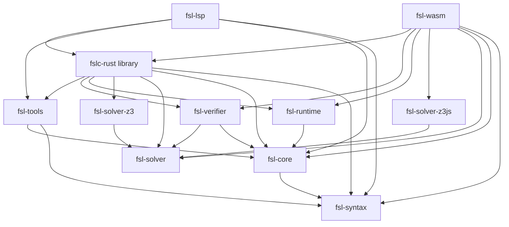

<!-- SPDX-License-Identifier: Apache-2.0 -->

# Rust component boundaries

Status: proposed current-architecture record at revision
`dc0f3fb3b6b22f84bf5f37432379641d4a08c0ca`.

## 1. Decision

Keep the current eleven-crate structure for the next twelve months and make its ownership rules
explicit. No split, merge, or new crate is justified by the available evidence.

The selected intervention is non-structural: this document consolidates the component contracts
already enforced by accepted design documents, Cargo dependencies, and executable tests. The
decision is provisional because production telemetry, organizational ownership, roadmap data, and
a blind temporal holdout are unavailable. Re-evaluate it when one of the triggers in section 10
occurs.

This decision is at the module/package level. It does not redesign individual language features,
change public schemas or process contracts, or make the frozen Python reference authoritative.

## 2. Decision frame and readiness

| Item | Value |
|---|---|
| Question | Should any current Rust crate be split, merged, or have state/responsibility moved, or is boundary clarification sufficient? |
| Scope | The eleven members of `rust/Cargo.toml`; the frozen `src/fslc` package is excluded. |
| Horizon | Twelve months of language evolution, verification work, editor support, and native/browser releases. |
| Outcome | Preserve semantic agreement while keeping changes attributable and delivery surfaces thin. |
| Decision owner | Maintainers; no business or operational owner was identified in repository evidence. |
| Risk posture | Conservative toward false-green verification and public-contract drift; neutral toward file or crate count. |
| Reproducibility | `Cargo.lock` is present. `./tools/check-native-integration.sh rust` passed locally at the baseline revision; the browser/npm half was not rerun for this documentation-only decision. |
| Runtime evidence | No production traces, incidents, SLOs, or on-call data were available. |
| History quality | Normal Git history is available, but most observed history is the short, high-change Rust migration period. |

Hard gates are:

1. `fsl-runtime` has no direct or transitive solver, Z3, JavaScript bridge, or LSP dependency.
2. `fsl-syntax` alone decides standard FSL parse acceptance and dialect dispatch. The legacy
   multi-declaration AI-project compatibility recognizer is the one explicit product exception.
3. `fsl-core` alone owns checked lowering, semantic model validity, provenance, and Public Kernel
   export.
4. concrete Monitor, solver-free explicit/BFS, and symbolic transition semantics agree, including
   negative controls for disabled and failed steps.
5. Public Kernel, replay, CLI, Worker, and LSP contracts remain versioned or explicitly shared and
   fail closed on unsupported input.
6. CLI and Worker do not independently decide semantic validity or warning meaning.
7. `fsl-wasm` does not acquire the native Z3 backend.
8. the required product gate remains Rust-native and does not invoke the frozen Python reference.

Any candidate that violates a gate is rejected rather than compensated by lower maintenance cost.

## 3. Evidence and contract classification

Evidence grades follow E3 (reproducible measurement), E2 (direct artifact), E1 (triangulated
inference), and E0 (assumption).

| ID | Grade | Claim and source | Decision use |
|---|---|---|---|
| E-01 | E2 | `rust/Cargo.toml` and crate manifests form an acyclic production dependency graph. | Establishes the current physical boundaries. |
| E-02 | E2 | `docs/DESIGN-rust-port.md`, `docs/DESIGN-rust-integration.md`, and `tools/check-native-integration.sh` define solver/runtime and delivery gates. | Establishes intended boundaries and hard gates. |
| E-03 | E2 | `KernelModel`, `Monitor`, `SmtSolver`, and `DocumentIndex` expose distinct state owners. | Establishes responsibility and state ownership. |
| E-04 | E2 | `rust/fsl-verifier/tests/transition_agreement.rs` accepts Monitor successors and rejects altered successors and corrupted failed-step evidence. | Establishes the concrete/symbolic semantic boundary with negative controls. |
| E-05 | E2 | Kernel, replay, native integration, LSP stdio, and corpus tests cover schema/process/editor boundaries. | Establishes separate public oracles. |
| E-06 | E1 | Cross-layer language changes repeatedly touch syntax, core, runtime/verifier, tools, and delivery code. | Shows real change propagation, but also matches the required coupled-change contract. |
| E-07 | E1 | From `295508e9^` through the baseline, 35 of 104 non-merge commits touch `rust/fslc/src/main.rs`; the file is also substantially larger than other entry modules. | Identifies an orchestration hotspot, not by itself a faulty crate boundary. |
| E-08 | E0 | Future team ownership, production scale, incident isolation, and roadmap likelihood. | Prevents service/organization-level restructuring claims. |
| E-09 | E3 | `./tools/check-native-integration.sh rust` passed with locked formatting, Clippy, LSP, workspace tests, build, and dependency checks. | Confirms the documented Rust boundaries are reproducible at the baseline revision. |

Scoped contract classifications are:

- **required:** authoritative standard-FSL parser dispatch plus the explicit legacy AI-project gate,
  typed Kernel model, solver-independent Monitor,
  concrete/symbolic agreement, versioned Public Kernel and replay, stable CLI/Worker output, latest
  LSP buffer semantics, and Rust-native release integration;
- **required compatibility:** unversioned action-only replay shapes, which the accepted replay
  contract explicitly promises to retain and which require migration rather than silent removal;
- **accidental/internal:** private AST and IR shapes, `HashMap` choices, token-walk order, and
  module layout below the published Rust APIs;
- **defect in documentation:** migration-era text that still described Python as the active
  authority after the Rust-native gate became authoritative;
- **unknown:** actual downstream use of legacy adapters and production performance/reliability
  obligations.

The critical contracts use more than one oracle type. Parser ownership combines example tests and
the corpus property; runtime semantics combine Monitor state-machine tests and symbolic
differential checks; public contracts combine schemas, goldens, and negative fail-closed cases;
LSP combines protocol/process tests with CLI diagnostic identity.

## 4. Dependency and execution model

Arrows mean “depends on”; dev-dependencies are omitted.



`fslc-rust` exposes a library without the `native-cli` feature so the LSP and Worker can reuse
diagnostic and result projections without pulling in native Z3, signing, or report-generation
dependencies. The executable enables those optional dependencies and is the native composition
root. `fsl-verifier` depends only on `fsl-core` and `fsl-solver` in production; runtime and native
Z3 appear only in its tests.

The shared execution path is:

```text
source
  +-> legacy AI-project compatibility recognizer
  |    -> direct compatibility analysis/projection (no KernelModel)
  `-> standard FSL through fsl-syntax parse/dialect dispatch
       -> fsl-core lowering, resolution, type checking, KernelModel
          -> fsl-runtime Monitor / replay / explicit BFS
          -> fsl-verifier symbolic verification through fsl-solver
          -> fsl-tools derived analysis and artifacts
       -> fslc-rust, fsl-wasm, or fsl-lsp projection
```

## 5. Component designs

### `fsl-syntax` — source fidelity owner

- Owns lexing, parsing, dialect dispatch, surface ASTs, annotations, source spans, lossless tokens,
  formatting, and canonical rewrites.
- Its authoritative state is an immutable source-faithful syntax value. It owns no checked model,
  runtime state, solver state, filesystem policy, or output envelope.
- It has no workspace dependency. Active delivery surfaces must not add a second standard-FSL
  grammar or accept a standard document rejected by `parse_document`; the legacy AI-project
  recognizer remains an explicitly bounded compatibility gate.
- Primary oracles are typed/spanned dialect parser tests, declaration-annotation tests, formatter
  idempotence, and LSP corpus coverage.
- Split only if a source representation gains an independent compatibility/version lifecycle; file
  count or AST size is insufficient.

### `fsl-core` — checked semantic model owner

- Owns dialect and compose lowering, name/type resolution, semantic validation, `KernelSpec`,
  `KernelModel`, origin/traceability registries, refinement mappings, deterministic diagnostics,
  and Public Kernel v1/v2 export.
- `KernelModel` is the authoritative internal definition of constants, types, state schema,
  initialization, actions, and properties. Runtime, verifier, tools, and frontends consume it.
- It depends only on `fsl-syntax`. File access is injected through `FileResolver`; the native
  `FsResolver` is an adapter, not permission for semantic code to open arbitrary paths.
- Unknown or unlowered public structures fail closed. Provenance is not fabricated.
- Primary oracles are model validation, duplicate-write rejection, origin-chain tests, Public
  Kernel schemas/goldens, and unsupported-node negative tests.

### `fsl-runtime` — concrete transition owner

- Owns concrete expression evaluation, `Monitor`, action enablement and atomic attempt semantics,
  rollback, replay, bounded-liveness observation, concrete refinement, solver-free BFS, and the
  explicit-state engine.
- `Monitor` owns the mutable logical state for one execution. A failed step keeps committed state
  unchanged; an attempted violating state is diagnostic evidence, not committed state.
- It depends on `fsl-core` only. It must remain isolated from every solver and delivery surface.
- Primary oracles include failed-step rollback, shortest replayable explicit traces, inclusive
  bounded-liveness deadlines, and verifier agreement tests.
- Move behavior out only if it is not part of concrete FSL semantics; convenience for one frontend
  is not a reason to duplicate a transition rule.

### `fsl-solver` — backend protocol owner

- Owns the minimal typed SMT vocabulary, `SmtSolver` protocol, satisfiability/model values, solver
  errors, and deterministic verification-cost aggregation.
- It owns no FSL AST, Kernel model, logical state, or backend assertion store. Concrete adapters own
  assertion/model state.
- It has no workspace dependency. Only satisfiability checks cross the asynchronous boundary;
  term construction remains synchronous.
- Primary oracles cover sort/operation shape and statistics attribution/merge behavior.
- Expand the trait only after a measured verifier need; it must not become a mirror of a particular
  Z3 API.

### `fsl-solver-z3` — native solver adapter

- Owns the native `SmtSolver` implementation, Z3 term handles, assertion stack, deterministic
  seeds, version reporting, model projection, and backend metrics.
- It depends on `fsl-solver` and the pinned native Z3 package. It does not own verification policy.
- Primary oracles cover arrays, substitution, stack behavior, assumptions, unsat cores, model
  projection, and linked-version identity.
- Backend-specific optimization stays here only when it preserves the shared solver protocol and
  passes agreement and product gates.

### `fsl-solver-z3js` — browser solver adapter

- Owns the `SmtSolver` implementation over opaque JavaScript term handles, Promise-based checks,
  stack accounting, version reporting, and metrics.
- The actual solver context lives behind the Worker-installed `globalThis.fslZ3*` bridge. This
  opaque JavaScript state is an explicit analysis blind spot for Rust-only tests.
- It depends on `fsl-solver` and `wasm-bindgen`, never on the native Z3 adapter.
- Its primary oracle is native-versus-browser envelope and witness-replay parity in the browser
  harness; a Rust unit test cannot establish bridge completeness.

### `fsl-verifier` — symbolic semantics owner

- Owns symbolic values and transitions, bounded model checking, induction, ranked liveness,
  refinement progress, and concrete/symbolic agreement queries.
- It owns only per-verification symbolic/result state. Solver assertions and models remain behind
  `SmtSolver`; concrete logical execution remains in `fsl-runtime`.
- Production dependencies are `fsl-core` and `fsl-solver`. Runtime and native Z3 are test-only so
  the library stays backend-neutral.
- Primary oracles compare expressions and transitions with reachable Monitor states and include
  altered-successor and rollback negative controls.
- It must not absorb the Monitor to reduce duplication: evaluator independence is a correctness
  control, not redundant architecture.

### `fsl-tools` — derived artifact owner

- Owns derived analysis graphs, causal/evidence models, DB/AI/domain engines, requirements-document
  IR and rendering, mutation, test generation, typestate, HTML, and ledger generation.
- Specialized models such as `CausalModel` and `RequirementClaimSet` are derived artifacts. They do
  not redefine `KernelModel` or verification verdicts.
- It depends on syntax/core and normally returns values, JSON, Markdown, HTML, or generated source;
  filesystem writes and process lifecycle belong to a delivery adapter.
- Primary oracles are schema/digest checks, renderer tamper rejection, domain regression tests,
  and refinement correspondence tests.
- Its breadth is not evidence for splitting. Split only when a tool family has an independent
  public lifecycle, dependency/failure boundary, and repeated changes that do not share Kernel or
  artifact infrastructure.

### `fslc-rust` — native composition and process-contract owner

- Owns command parsing/dispatch, filesystem and process adapters, native backend selection, stable
  JSON envelopes, stdout/stderr discipline, normalized exit status, approvals, migration, replay
  input, coverage vectors, and result rendering.
- It owns process-local orchestration, not FSL meaning. Semantic validity and transition/verdict
  rules must be delegated to core, runtime, verifier, and tools.
- The `native-cli` feature is the native composition boundary. With default features disabled, the
  library exposes shared frontend/result projections to the Worker and LSP without native-only
  dependencies.
- Primary oracles are the embedded CLI contract, native integration tests, Kernel/replay schemas
  and goldens, CLI/LSP diagnostic identity, and native/Worker parity.
- `main.rs` is a real change hotspot. Continue local extraction only when a command family can move
  with unchanged process contracts and a narrow rollback; do not create a new crate from line count
  alone.

### `fsl-wasm` — browser composition owner

- Owns Worker request decoding, in-memory files, `MemoryResolver`, browser Z3 selection, progress-
  compatible asynchronous execution, and stable JSON response projection for supported commands.
- It owns no persistent logical state or host filesystem. Cancellation and Worker recreation are
  transport lifecycle concerns outside the semantic engines.
- It composes syntax/core/runtime/verifier, `fsl-solver-z3js`, and the feature-minimal `fslc-rust`
  library. Native Z3 is forbidden.
- Primary oracles are focused Rust tests plus native/browser envelope comparison, replay validation,
  transport failure, and cancellation recovery in the browser harness.
- Browser-only behavior belongs here or in its JavaScript Worker wrapper; shared meaning belongs in
  solver-independent crates.

### `fsl-lsp` — editor state and protocol owner

- Owns stdio LSP framing, open-document overlays, workspace roots, filesystem fallback for unopened
  imports, source-positioned `DocumentIndex`, and protocol projections for diagnostics and queries.
- `ServerState` owns the latest open buffers; `DocumentIndex` is a recreated projection of parsed
  syntax and lossless spans, not an alternative parser or semantic model.
- It composes syntax/core/tools and the feature-minimal `fslc-rust` diagnostic API. Stdout is
  reserved for LSP framing.
- Primary oracles are latest-buffer stdio lifecycle, corpus identifier coverage, UTF-16 range and
  resolved-edit tests, and CLI/LSP diagnostic identity.
- Move an editor operation into shared code only when its result is a compiler contract rather than
  an LSP projection.

## 6. Design pressures and unknowns

| Pressure | Evidence | Priority | Current response |
|---|---|---|---|
| Cross-layer semantic changes touch many crates. | Multiple language/effect/liveness commits plus coupled-change tests. | High consequence, high recurrence, medium uncertainty. | Preserve explicit ownership and agreement gates; do not hide required coupling behind a facade. |
| Native command orchestration is concentrated in `fslc/src/main.rs`. | Responsibility inventory and the reproducible `295508e9^..dc0f3fb` non-merge history range. | Medium consequence and recurrence, medium uncertainty. | Permit small in-crate extractions; require scenario evidence before a crate split. |
| Browser backend behavior is opaque to Rust-only analysis. | JavaScript global bridge and absence of standalone Rust backend tests. | High consequence, medium recurrence. | Keep browser parity/cancellation as a required separate gate. |
| Architecture authority text drifted after migration. | Migration-era Python statements contradicted the native integration contract. | Medium consequence, observed recurrence. | Consolidate this record and correct stale authority wording. |
| Production-log replay lacks comprehensive coverage in the required Rust gate. | The native implementation is direct, while focused and broader cases are Python-driven tests excluded from the product gate. | High consequence, unknown recurrence. | Treat coverage as unknown; add Rust-native regression cases before changing mapped-log semantics. |

Unknowns that could reverse the decision are production incidents or SLO failures attributable to
one component, independent team/deployment ownership, a roadmap requiring a separately versioned
tool API, measured command-change cost, downstream dependence on legacy adapters, and untested
native production-log replay cases. The cheapest useful evidence is a future change log that
records semantic responsibility touched and failed gate, plus focused Rust-native replay cases
before that behavior changes—not a repository-wide proxy metric.

## 7. Frozen scenarios

The following scenarios define the design evaluation. History used to construct them is not a blind
holdout; later commits were already visible to the same evaluator.

| Scenario | Family | Acceptance criteria |
|---|---|---|
| Add one expression or binder feature across dialects. | Historical/roadmap | One parse owner, one checked lowering, concrete/symbolic agreement, updated public coverage, unchanged delivery ownership. |
| Change bounded liveness or rollback behavior. | Historical/adversarial | Monitor and symbolic semantics agree; a known invalid trace or successor is rejected; envelopes remain replayable. |
| Add a review-only specialized dialect/tool. | Historical/roadmap | It remains in syntax/tools unless it intentionally enters Kernel semantics; no false formal assurance is emitted. |
| Change a shared diagnostic. | Delivery interaction | CLI and LSP preserve identity; Worker uses the same semantic gate; LSP ranges and CLI envelope stay transport-specific. |
| Upgrade or fail one solver backend. | Adversarial/portability | `SmtSolver` contract holds, runtime stays solver-free, native Z3 stays out of WASM, and witness replay validates nondeterminism. |
| Add a large CLI command family. | Roadmap | Semantic work remains below the composition root; I/O and exit contracts are tested; local extraction is possible without a new public boundary. |
| Release on every supported target. | Interaction/transition | CLI/LSP pair, schemas, and checksums remain an atomic release unit; required native gate stays green. |

## 8. Candidates and adjudication

### C0 — retain code and documentation unchanged

- Transition and rollback: none.
- Benefit: zero migration risk.
- Harm: no maintained per-component ownership map; stale authority wording remains easy to misuse.
- Gate result: passes structural gates but does not satisfy the requested design-recovery outcome.

### C1 — clarify boundaries without structural change (selected)

- Transformation: add this consolidated record, align stale migration-era authority statements,
  add the missing corrupted-failure negative control to transition agreement, and reuse existing
  executable gates as fitness functions.
- Transition: documentation plus one test-only negative control, with no product behavior,
  compatibility, or runtime window.
- Rollback: revert the documentation and the isolated test assertion.
- Benefit: makes ownership and non-ownership explicit without creating another runtime abstraction.
- Harm: does not reduce `main.rs` size or cross-layer language-change breadth.
- Falsifier: a future change cannot be assigned to one semantic owner, or repeated gate failures
  show that the documented composition boundary does not isolate delivery concerns.
- Gate result: no observed gate violation and the Rust half passed at E3. The unchanged browser
  boundary retains E2 contract evidence, but its npm/browser gate was not freshly rerun.

### C2 — structurally extract native command orchestration

- Transformation: move independently testable command families out of `fslc/src/main.rs` behind
  existing in-crate modules; consider a new shared crate only after those modules demonstrate an
  independent lifecycle.
- Transition: one command family at a time, preserving exact CLI/Worker/LSP projections; rollback
  is the isolated extraction commit.
- Expected benefit: smaller decision context and fewer unrelated edits in the entry module.
- Expected harm: moved code, changed visibility, and possible duplication of composition policy;
  a new crate would add a version/dependency boundary without current consumer need.
- Falsifier: replayed changes touch the same responsibilities after extraction or require broader
  fixtures than before.
- Gate result: not tested. The hotspot evidence cannot distinguish legitimate composition cohesion
  from harmful coupling, so implementation is not justified now.

C1 does not robustly dominate C0 on change cost, but C0 fails the requested outcome. C2 has only a
speculative maintainability benefit and higher verification/migration cost. Under a delivery-speed,
correctness-risk, or flat-roadmap weighting, C1 remains the least-regret reversible choice. A future
independent command team or repeated cross-command regression could make C2 preferable.

## 9. Migration slice and fitness functions

The smallest reversible slice is the documentation consolidation plus one missing conformance
negative control. Entry criteria are an identified component inventory and current Cargo graph;
exit criteria are an explicit owner, non-owner, dependency rule, oracle, and reevaluation trigger
for every crate, plus rejection of failure evidence with the wrong attempted-state presence. There
is no data migration, compatibility window, feature flag, or irreversible action.

Existing fitness functions remain authoritative:

| Intent | Mechanism | Expected result |
|---|---|---|
| Keep runtime solver-independent. | `tools/check-native-integration.sh` dependency inspection | No `fsl-solver` or Z3 in the normal `fsl-runtime` tree. |
| Keep WASM free of native Z3. | Same dependency inspection | No normal `fsl-solver-z3` dependency. |
| Keep semantic paths aligned. | verifier expression/transition agreement tests | Valid Monitor facts are accepted and deliberately altered facts are rejected. |
| Keep Public Kernel complete and fail closed. | Kernel schema, conformance coverage, and negative tests | Every registered semantic/outcome feature is covered; unsupported nodes fail. |
| Keep replay evidence executable. | replay schema/goldens and Monitor replay tests | Complete typed observations conform; malformed input and wrong states fail with the contracted exit. |
| Keep delivery projections stable. | native integration, LSP stdio/corpus, and browser parity tests | CLI, LSP, and Worker preserve their shared identities and transport-specific contracts. |

## 10. Residual risk and reevaluation

Decision confidence is **medium**: major boundary claims have E2 artifact and executable-oracle
support, but transition experiments for C2, production evidence, operational ownership, and a blind
holdout are missing; production-log replay also lacks comprehensive Rust-native regression coverage.
Role separation during this recovery used multiple read-only evidence passes, but proposal and
adjudication still share one primary model and are not statistically independent.

Re-evaluate before the twelve-month horizon if:

- three unrelated command changes fail because of `fslc` orchestration coupling;
- `fsl-tools` gains an independently versioned external consumer or incompatible dependency;
- a production incident or SLO identifies a failure-isolation boundary absent from the crate graph;
- LSP or Worker cannot reuse a shared diagnostic/result without importing inappropriate native
  dependencies;
- runtime acquires pressure to depend on a solver or a frontend starts duplicating semantics;
- a major Public Kernel/replay version changes state ownership; or
- a normal-maintenance holdout shows materially different co-change behavior from the migration
  period.

The recommendation is falsified if a locally extracted command family demonstrably reduces the
semantic responsibilities, contracts, and test environments touched by representative changes
without weakening any hard gate. Until then, documentation and executable boundary checks have
greater option value than a structural migration.
