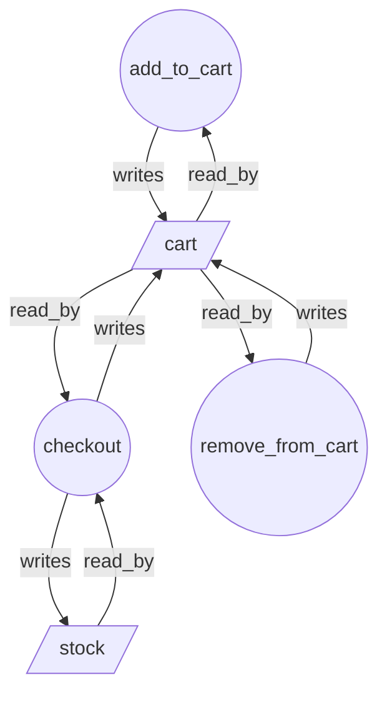

# `fslc analyze` 実践ガイド — 仕様の「構造」を見るレビュー入口

`fslc verify` / `fslc refine` は「宣言した契約が成り立つか」を答える。
`fslc analyze` はそれとは別の問いに答える —— **この仕様はどんな形をしていて、
どこがレビューする価値があるほど結合が薄いか**。

verify が「正しさ」を、analyze が「構造」を扱う。両者は置き換え関係ではなく、
analyze はレビューや検証の**前段**で「どこを読むべきか」を機械的に先に絞るための
コマンドである。

> 実装設計の一次情報は [`DESIGN-analysis.md`](DESIGN-analysis.md)、
> マニュアルページは [`intro/analysis.ja.html`](intro/analysis.ja.html) にある。
> 本ガイドはチーム導入向けに、使い方・出力・findings・ワークフロー組み込みを
> 実際の出力例つきで通しで説明する。

---

## 0. 3行まとめ

- `fslc analyze spec.fsl` は仕様を**決定的な構造グラフ（JSON）**にする。要件・操作・状態・性質・シナリオが「何を読み・何を書き・何につながっているか」の地図。
- `--profile ai-review` は、guard のない更新操作・一度も書かれない状態・根拠の薄い性質・孤立した要件などを **`review_required`（要確認）** として出す。**違反判定ではない。**
- Z3 も到達可能性探索も走らない。だから速く、決定的で、CI・PR・エディタ・可視化ツールにそのまま渡せる。

---

## 1. 位置づけ —— なぜ analyze か

レビューで時間を食うのは、正誤判断そのものより「どこを読むべきか」「この上位要求は
下位設計のどこに落ちているか」を探す時間である。analyze はその探索を先に済ませる。

| 手作業でかかること | analyze が先に出すもの | 効果 |
|---|---|---|
| 変更した操作がどの状態に影響するか探す | 操作↔状態の read/write グラフ（`action_state_graph`） | 影響範囲の探索を短縮、読む対象を絞れる |
| 要件IDが実際の性質・設計操作に結びついているか追う | 要件・性質・シナリオ・refinement のグラフ | トレーサビリティ確認を再現可能にできる |
| 全宣言を均等に読んで怪しい箇所を探す | `ai-review` findings | 最初に見るべき候補が並ぶ、レビュー順序を決めやすい |
| PRコメント用に根拠を説明する | witness / candidate_repair / do_not_assume 付き JSON | 指摘の根拠と注意点をそのまま共有できる |

**重要な境界**: analyze はレビューを置き換えない。仕様判断は人間が行う。効果は
「レビュー前半の探索と根拠集め」を短縮する点にある。

---

## 2. 基本の使い方

```bash
# 既定 = TSG（Typed Semantic Graph）を JSON で出力
fslc analyze specs/cart_v1.fsl

# グラフ projection を選ぶ
fslc analyze specs/cart_v1.fsl --projection action_state_graph
fslc analyze specs/cart_v1.fsl --projection requirement_property_graph
fslc analyze specs/cart_v1.fsl --projection property_state_graph

# レビュー候補（findings）を出す
fslc analyze specs/cart_v1.fsl --profile ai-review

# 宣言タグと形式定義を1宣言ずつ外部レビューへ渡す
fslc analyze specs/cart_v1.fsl --export tag-review

# ディレクトリ・複数ファイルを一括（バッチ）
fslc analyze specs/ examples/e2e/ --profile ai-review

# refinement マッピング単体 / プロジェクトマニフェスト
fslc analyze specs/cart_refines.fsl --projection refinement_graph
fslc analyze fsl-project.toml --projection traceability_graph

# 可視化向けエクスポート
fslc analyze specs/cart_v1.fsl --projection action_state_graph --format dot
fslc analyze specs/cart_v1.fsl --projection action_state_graph --format mermaid
```

**引数の要点**

- `--projection`: `tsg`（既定）/ `action_state_graph` / `requirement_property_graph` / `property_state_graph` / `refinement_graph` / `traceability_graph`。
- `--profile ai-review`: findings モード。projection ではなく「所見の抽出」を行う。
- `--export tag-review`: タグ付き宣言を `(tag, formal_definition, identifiers)`
  の固定JSONにする単一ファイル専用モード。自然言語と式の意味一致は判定しない。
- `--format`: `json`（既定）/ `dot` / `mermaid`。DOT・Mermaid は**グラフ形状の projection のみ**（findings や非グラフには使えない）。Graphviz / Mermaid ランタイムには依存しない（文字列を生成するだけ）。

**終了コードと result（他コマンドと同じ契約）**

- 成功: `result: "analyzed"`、exit `0`。
- parse / name / type / semantics / io / internal のエラーは通常の fslc エラーエンベロープを再利用。
- バッチで1ファイルでも失敗すると exit `2`（成功分は `files[]` に残り、失敗分は `errors[]` に要約）。

---

## 3. 出力の全体像

すべて `_envelope` でラップされ、先頭に `{"fsl": "1.0", "result": "analyzed", ...}` が付く。
単一ファイル・TSG の例（`fslc analyze specs/cart_v1.fsl`）:

```json
{
  "fsl": "1.0",
  "result": "analyzed",
  "spec": "ShoppingCart",
  "analysis": "structure",
  "projection": "tsg",
  "schema_version": "tsg.v0",
  "nodes": [ { "id": "action:checkout", "kind": "action", ... } ],
  "edges": [ { "id": "edge:...", "kind": "writes", "from": "...", "to": "..." } ]
}
```

`cart_v1.fsl` の TSG は実測で **19 ノード / 41 エッジ**。内訳:

- ノード種別: `action`×3, `guard`×4, `effect`×4, `ensures`×1, `state`×2, `phys_state`×3, `reachable`×1, `spec`×1
- エッジ種別: `declares`×9, `reads`×11, `writes`×8, `has_guard`×4, `has_effect`×4, `has_ensures`×1, `checks`×1, `expands_to`×3

決定性が保証されている（ノード/エッジは安定ソート・重複排除済み）ので、
差分（diff）やスナップショットに向く。

---

## 4. TSG（Typed Semantic Graph）—— すべての土台

TSG は生の文法タプルではなく、**`build_spec` が返した検証済み spec dict**から構築する。
つまり verify / scenarios / replay / explain と**同じ意味論ビュー**の上に立つ。
すべての projection と findings はこの TSG から派生する。

**安定ノード種別**: `spec`, `requirement`, `state`, `phys_state`, `action`, `guard`,
`effect`, `ensures`, `invariant`, `trans`, `leadsTo`, `reachable`, `acceptance`,
`forbidden`（spec がメタデータを持てば `kpi`, `control` も）。

**安定エッジ種別**: `declares`, `covers`, `has_guard`, `has_effect`, `has_ensures`,
`reads`, `writes`, `checks`, `starts_with`, `precedes`（物理変数展開の `expands_to` など）。

読み取り（reads）の抽出は式を保守的に走査し、束縛変数（forall/exists/sum/count の
ローカル束縛）を正しく除外する。書き込み（writes）は代入文の左辺ルートから取る。
このため「どの操作がどの状態を実際に触るか」は grep より正確に出る。

---

## 5. グラフ projections

各グラフ projection は `components`（連結成分）, `sccs`（強連結成分）, `cycles`
（代表閉路）, `degree`（入次数/出次数）, `formal_status: "not_a_violation"` を含む。
**孤立した成分や閉路があっても、それは証明の失敗ではない。下流レビューのための構造情報にすぎない。**

| projection | 何をつなぐか | 主な用途 |
|---|---|---|
| `action_state_graph` | 操作 ↔ 読み書きする状態変数 | 変更の**影響範囲**を掴む |
| `requirement_property_graph` | 要件 ↔ 被覆する操作・性質・シナリオ・KPI/control | 要件の**カバレッジ**を追う |
| `property_state_graph` | 性質 ↔ 読む状態変数 | 性質が何に依存しているかを見る |
| `refinement_graph` | refinement マッピング単体（impl/abs 名・state map・action map・stutter・progress） | マッピングの構造レビュー |
| `traceability_graph` | プロジェクトマニフェスト（business/requirements/design ＋ refinement） | 層をまたぐ**トレーサビリティ** |

`.toml` を直接渡すとプロジェクトマニフェストとして扱う（既定名 `fsl-project.toml`、
レビュー用の別名コピーも可）。

---

## 6. `--profile ai-review` findings —— レビュー候補の抽出

findings は**決定的なヒューリスティック**で、すべて `severity: "review_required"`、
`formal_status: "not_a_violation"` を持つ。構造所見に加え、深さ4のBMCで裏付ける未決定領域所見がある:

| finding_type | 何を指すか | confidence |
|---|---|---|
| `disconnected_requirement` | 要件ノードが操作・性質・受入/禁止シナリオ・KPI/control・governanceメタのどれにもつながっていない | 0.80 |
| `unanchored_property` | ユーザー性質（invariant/trans/leadsTo/reachable）が要件タグ・シナリオ・操作↔状態のどれにも錨づいていない | 0.70 |
| `progressless_cycle` | 要件/シナリオに紐づく多操作の構造閉路に、明示的な進行（leadsTo/有界exit/terminal/fairness）が付いていない | 0.68 |
| `unwritten_state` | 状態変数が初期化されるが、どの操作も書き込まない | 0.68–0.76 |
| `unguarded_action` | 非生成の操作に `requires` が一つもない（構造上、常時実行可能に見える） | 0.72 |
| `tag_stale_reference` | タグ中のコード形状識別子が現在の仕様に存在しない | 0.82 |
| `tag_formula_disjoint` | タグが名指すstate/constを形式定義が参照しない | 0.74 |
| `divergent_choice` | 同一の到達状態で2操作が有効になり、invariant / acceptance の真偽が分かれる | 0.86 |
| `unconstrained_effect` | 未観測状態に、同一の到達状態から2操作が異なる次値を書ける | 0.82 |
| `traceability_gap`（プロジェクト層のみ） | 上位層の要件/control ID に、下位層の構造的アンカーが見えない | 0.74 |

各 finding は次のフィールドを持つ:
`finding_id`, `analysis`, `finding_type`, `severity`, `confidence`, `formal_status`,
`involved_nodes`, `witness`（根拠）, `why_it_matters`（なぜ気にするか）,
`candidate_repairs`（直し方の候補）, `do_not_assume`（早合点してはいけないこと）,
（可能なら）`loc`（ソース位置）。

`divergent_choice` / `unconstrained_effect` はさらに
`evidence_basis: "bounded_bmc"`、到達 step と depth を含む witness、末尾が `?` の
`spec_question` を持つ。この質問を仕様責任者へ渡し、AIが勝手に分岐を選んだり
制約を発明したりしない。所見がないことは深さ4を超えた決定性の証明ではない。
BMC witness がある場合、同じ state/action の `unread_state` / `unguarded_action` は
二重表示せず、強い意味論所見へ一本化する。

さらに、所見の `involved_nodes` が `"undecided: 理由"` タグ付き宣言と一致すると、
所見は抑制されず `acknowledged: true` と `acknowledged_by`（宣言名・理由）を持つ。
一致しない所見には acknowledgement フィールドを追加しない。前者は
「意図的に先送り済み」、フィールドのない後者は「未処理」としてレビューキューを分ける。
`undecided:` は検証条件ではなく、通常の `verify` は引き続き全ての解決に対して
安全性を検査する。設計詳細は `DESIGN-undecided.md` を参照。

### 6.1 実例

デモ仕様 `OrderReview`（`submit()` に guard なし、`audit_ready` を誰も書かない）を
`--profile ai-review` にかけると 2 件出る:

```
STRUCT-UNGUARDED-ACTION-0001  unguarded_action  conf=0.72  nodes=[action:submit]
STRUCT-UNWRITTEN-STATE-0001   unwritten_state   conf=0.76  nodes=[state:audit_ready]
```

`unwritten_state` の全文（`audit_ready` は invariant が読むだけで、どの操作も書かない）:

```json
{
  "finding_id": "STRUCT-UNWRITTEN-STATE-0001",
  "finding_type": "unwritten_state",
  "severity": "review_required",
  "confidence": 0.76,
  "formal_status": "not_a_violation",
  "involved_nodes": ["state:audit_ready"],
  "witness": {
    "kind": "state_has_no_action_writes",
    "node": "state:audit_ready",
    "read_by": ["invariant:AuditGate"]
  },
  "why_it_matters": "The state variable is initialized but no action writes it in the structural graph.",
  "candidate_repairs": [
    { "kind": "review_state_role",
      "template": "Make the value a const/model parameter if it is intentionally fixed, or add the missing action/effect that changes it." }
  ],
  "do_not_assume": [
    "The state variable is useless.",
    "A verifier property is violated.",
    "The variable is safe to delete without checking generated dialect state."
  ]
}
```

実運用の corpus に対しても findings は**過検出しない**設計で、`specs/` 23ファイルの
バッチ走査では `rate_limiter.fsl` の `tick()`（refill 操作に guard なし）1件のみが挙がる。
残りはすべて 0件。findings は「ノイズを浴びせる」のではなく「最初に見るべき数件」を出す。

### 6.2 過度に断定しない設計

- `progressless_cycle` は公開出力で `H1` / `Betti` / `homology` などの語を使わず、
  `retry` / `pending` のような言語依存の単語にも依存しない。閉路は正当なリトライ・
  レビュー・補償かもしれない。finding が言うのは「進行の物語が見えない」だけ。
- すべての finding に `do_not_assume` が付き、「これは違反ではない」「名前が似ている
  だけで意味的被覆の証明にはならない」といった早合点への歯止めを明示する。

---

## 7. 出力フォーマット（JSON / DOT / Mermaid）

`--format dot` / `--format mermaid` は、グラフ形状の projection をそのまま可視化ツールへ
渡すためのエクスポート。JSON 以外は生テキストを stdout に出す（エンベロープでは包まない）。

`fslc analyze specs/cart_v1.fsl --projection action_state_graph --format mermaid` の実出力:



そのまま GitHub の PR 説明・Issue・Wiki に貼れば図としてレンダリングされる。
DOT は Graphviz、Mermaid は各種ドキュメントツールへ。

---

## 8. バッチモード

ファイルとディレクトリを混在で渡せる。ディレクトリは `*.fsl` を再帰展開し、正規化パスで
ソートして、`mode: "batch"` の**1つの決定的な JSON エンベロープ**にまとめる。

- 各ファイルの結果は `files[]` に、各エントリは `summary`（findings 件数など）と
  `findings` を持つ。
- 1つでも失敗すると全体 `result: "error"`、exit `2`。成功分は `files[]` に残り、
  失敗分は `errors[]`（file / result / kind / message / loc）に要約される。
- バッチは `--format json` のみ（DOT/Mermaid は単一グラフ向け）。

CI で「リポジトリ全体の構造レビュー候補」を一括収集するのに向く。

---

## 9. プロジェクト・トレーサビリティ（`traceability_graph`）

`fsl-project.toml`（business / requirements / design ＋ refinement マッピング）を渡すと、
**層をまたいだ1枚のトレーサビリティグラフ**を作る。各層のノードは層名でプレフィックスされ、
refinement の state map / action map / stutter / preserve-progress、および同一ID・
refinement 経由の `lower_anchor` エッジで層が接続される。

実測（`tests/fixtures/chain/fsl-project.toml`）: 33 ノード / 58 エッジ、3 連結成分、閉路 0。
`business_spec` / `requirements_spec` / `design_spec`、`refinement`、`action_map`、
`state_map`、`stutter_map` などが1つのグラフに乗る。

上位層の要件/control ID に下位層の構造アンカーが見えないと `traceability_gap` finding が
出る。ただしこれもレビュー専用 —— **検証済みの refinement 証拠は依然 `fslc chain` /
`fslc refine` の仕事**であり、analyze はその穴の「候補」を示すだけ。

---

## 10. スキーマとバージョニング

バージョン付きスキーマは `schemas/fslc/analysis/` にある:

- `tsg.v0.schema.json`
- `analysis-graph.v0.schema.json`
- `analysis-findings.v0.schema.json`

下流の消費者は形状を仮定する前に `schema_version`（`tsg.v0` / `analysis-graph.v0` /
`analysis-findings.v0`）を確認すること。**追加の任意フィールドは同一バージョン内で
増えうる**。必須フィールドの削除・意味変更は新バージョンで行う。

---

## 11. LSP 連携

`fslc-lsp` は `FSLC_LSP_ANALYSIS_DIAGNOSTICS=1` を付けて起動すると、
`--profile ai-review` の findings を**情報レベルの診断**としてエディタに出せる。
診断は可能なら TSG ノードのソース位置を使い、なければ最良のインデックス済み宣言範囲に
フォールバックする。**verifier のエラーではなく、`fslc analyze` の構造レビュー信号**である
ことは明示される。

---

## 12. 境界 —— analyze は verify ではない

- **Z3 を呼ばない / 到達可能性を解かない / replay しない / refinement 証明をしない。**
  だから速く決定的だが、構造所見は「証拠」ではない。
- 構造所見は `formal_status: "not_a_violation"` を持つ。**閉路があるだけ、guard がない
  だけでバグとは言わない。**
- 形式的な証拠や実装適合が必要なときは `verify` / `refine` / `replay` を使う。
- 将来、証明ステータスを持つ finding を足すなら、既存の verifier / refinement / replay
  の結果を明示的に呼び・消費し、その根拠を JSON に書くべき（設計方針）。

---

## 13. 関連手法との位置づけ —— 何が借り物で、何が珍しいか

「形式モデルを実行せずに、その構造をグラフや行列として解析する」というアイデア自体は
新しくない。analyze は確立された先行技術の系譜に立っており、そこを正直に押さえておく方が、
導入判断も将来の拡張も健全になる。この節では代表的な先行技術と、その上で FSL の
組み合わせとして一般的でない点を分けて記す。

### 13.1 直接の先行技術

| 先行技術 | 何を計算するか | analyze との対応 |
|---|---|---|
| ペトリネットの構造解析（TINA〔LAAS/CNRS〕、GreatSPN など） | 接続行列の線形代数から P-不変量（トークン重み付き和の保存量）・T-不変量（正味効果ゼロの遷移列）を、グラフ条件からサイフォン・トラップを、**状態空間を構築せずに**計算する。数十年の蓄積がある古典的分野 | 「実行せず構造だけから性質の候補を出す」という analyze の基本姿勢の、最も古典的な形 |
| SPARK / GNATprove のフロー解析 | `Global` / `Depends` 契約と実装の突き合わせ、未初期化読み・無効な代入（dead write）・未使用変数の検出。証明（proof）とは**別モード**（`--mode=flow` / `--mode=prove`）として同じソースの上で走る | 「証明レイヤの隣に、同じ意味モデルを見る解析レイヤを別建てする」構図が analyze / verify の分離に最も近いアーキテクチャ上の先行例 |
| Frama-C（PDG / Slicing / Impact プラグイン） | C プログラムの依存グラフ（Program Dependence Graph）を構築し、スライシングや変更影響解析に使う | `action_state_graph` で変更の影響範囲を絞る使い方の、プログラム側での先行例 |
| Event-B / Rodin | machine / context を refines・extends・sees 関係で階層化し、証明義務を要素ごとに自動生成・追跡する | 層をまたぐ開発構造を明示的な依存構造として扱う点が `traceability_graph` の先行例 |
| 証明支援系の依存グラフ（coq-dpdgraph、Isabelle の theory graph、Lean の import-graph） | 定義・定理・理論ファイル間の依存グラフを抽出し、未使用の補題（`dpdusage`）や冗長 import（`#redundant_imports`）を発見する | 「宣言が孤立している／使われていない」を構造から拾う `disconnected_requirement` / `unwritten_state` 系 findings の先行例 |
| mCRL2 の静的 LPS 解析（`lpsparelm` / `lpsconstelm`） | モデル検査の前処理として、線形プロセス仕様から「挙動に影響しないパラメタ」（直接にも、他のパラメタ経由でも action / condition に届かないもの）や「定数のままのパラメタ」を**状態空間を作らずに**除去する | モデル検査ツールセットの内部にも「構造だけを見る層」が実在する例。unused / unwritten 系 findings の意味論的に鋭い先行例（到達性は推移的に判定する） |

### 13.2 別カテゴリ —— 状態空間を探索する系譜

TLA+/TLC・SPIN・UPPAAL のようなモデル検査器が解析するのは**到達可能な状態空間のグラフ**
であって、仕様テキストの構造グラフではない。到達可能性の探索は fslc では verify
（BMC / k-induction）側の仕事であり、analyze の比較対象ではない。Alloy Analyzer の
グラフ表示も、ソルバが見つけた**インスタンス（実例・反例）**の可視化であって、
仕様構造そのものの解析とは役割が違う。この2つのカテゴリを混同しないこと。
ただし前掲の mCRL2 のように、状態空間系のツールセットの中に静的な構造解析層が併設される
のは珍しくなく、「構造を見る層」と「実行を調べる層」の分業自体が形式手法ツールの
定番構成だと言える。

### 13.3 閉路と位相の語彙について

`progressless_cycle` の「閉路を構造の信号として数える」という見方にも系譜がある。
McCabe の循環的複雑度は制御フローグラフの独立閉路数（グラフ理論の cycle rank、
位相の言葉では 1 次ベッチ数に相当）だし、並行計算の directed algebraic topology
（Fajstrup・Goubault・Raussen ら）は実行空間の幾何・位相からデッドロック等を解析してきた。
analyze が公開出力でこの語彙（`H1` / `Betti` / `homology`）を意図的に使わないのは、
概念の系譜を否定しているのではなく、「構造所見を証明と誤読させない」ための出力設計である
（[`DESIGN-analysis.md`](DESIGN-analysis.md) 参照）。

### 13.4 では FSL の analyze は何が珍しいか

個々の技法が借り物であることを認めた上で、**組み合わせ**として一般的でない点は次の4つ:

1. **verify と同じ検証済み意味モデルを共有する。** analyze は `build_spec` が返した
   spec dict（verify が消費するのと同一物）から TSG を作る。別パーサや正規表現で
   仕様を近似し直すのではない。SPARK のフロー解析が証明と同じソース・同じ契約の上に
   立つのと同型だが、仕様記述言語でこの構成を取る例は多くない。
2. **すべての構造信号に `formal_status: "not_a_violation"` を機械可読で刻む。**
   「これは証明ではない」という認識論的な位置づけを出力契約そのものに埋め込む設計は、
   先行ツールではあまり見られない。
3. **findings が LLM の write→verify→repair ループ向けに整形されている。**
   `witness` / `candidate_repairs` / `do_not_assume` は人間向けレポートの副産物ではなく、
   エージェントが「どこを直すか」「何を早合点してはいけないか」を構造化入力として
   受け取るための一次設計である。
4. **refinement 証明とは別立ての、層をまたぐトレーサビリティ・グラフ。** 要求トレーサビリティ
   の管理自体は要求工学の定番プラクティスだが、business→requirements→design の構造グラフ
   （`traceability_graph`）を、証明（`fslc chain` / `fslc refine`）と明確に区別された
   **レビュー成果物**として同じツールチェーンから出す構成は一般的ではない。

まとめると、「構造グラフ解析そのもの」に新規性を主張する意図はない。analyze の価値は、
確立された解析技法を「検証器と同じ意味モデル・誠実な出力契約・AI エージェント前提の整形」
という組み合わせで小さく提供する点にある。今後の findings / projection の拡張も、
この節の先行技術から輸入するのが基本方針である。

---

## 14. ワークフローへの組み込み（実践）

**A. PR レビューの前段**
変更した spec に `--projection action_state_graph --format mermaid` をかけ、影響範囲図を
PR 説明に貼る。レビュアは「どの操作がどの状態に効くか」を全文読解せず把握できる。

**B. レビュー優先順位づけ**
`--profile ai-review` を先に回し、`unguarded_action` / `unwritten_state` /
`unanchored_property` を「最初に確認する数件」として拾う。findings の `witness` と
`candidate_repairs` をそのままレビューコメントの根拠にできる。

**C. CI の構造ゲート（ソフト）**
`fslc analyze specs/ --profile ai-review` をバッチで回し、findings 件数を PR にレポート。
**exit code でブロックする用途ではない**（`analyzed` は成功）。「新規の
`disconnected_requirement` が増えたら要確認」のような**軽い注意喚起**に使う。

**D. トレーサビリティ点検**
`fslc analyze fsl-project.toml --projection traceability_graph` で層間の `traceability_gap`
を洗い出し、`fslc chain` の証明前に「拾い漏れた上位要求」を潰す。

**E. LLM の write→verify→repair ループ**
findings は機械可読で `candidate_repairs` / `do_not_assume` を持つため、エージェントが
「どこを直すべきか／早合点してはいけない点」を構造化入力として受け取れる。

---

## 15. まとめ

`fslc analyze` は verify の代わりではなく、**verify の前に立つレビューの地図**。

- 仕様の構造を決定的な JSON グラフにし、影響範囲・カバレッジ・トレーサビリティを機械的に出す。
- `--profile ai-review` は根拠つきのレビュー候補を出す（違反判定ではない）。
- Z3 非依存で速く決定的、JSON/DOT/Mermaid/Schema で PR・CI・エディタ・可視化ツールに渡せる。

「まず analyze で見るべき場所を絞り、verify / refine で正しさを証明する」——
これが analyze の意図した使い方である。

---

### 付録: 本ガイドで使ったデモ仕様

```fsl
// findings を意図的に残したデモ仕様
spec OrderReview {
  enum Status { Draft, Submitted, Approved }

  state {
    status:      Status,
    approvals:   Int,
    audit_ready: Bool
  }

  init {
    status = Draft
    approvals = 0
    audit_ready = false
  }

  // requires なし → 常時実行可能に見える（unguarded_action）
  action submit() {
    status = Submitted
  }

  action approve() {
    requires status == Submitted
    status = Approved
    approvals = approvals + 1
  }

  // audit_ready は init されるが、どの action も書かない（unwritten_state）
  invariant AuditGate { audit_ready == false or status == Approved }
  invariant Counters { approvals >= 0 }
}
```
